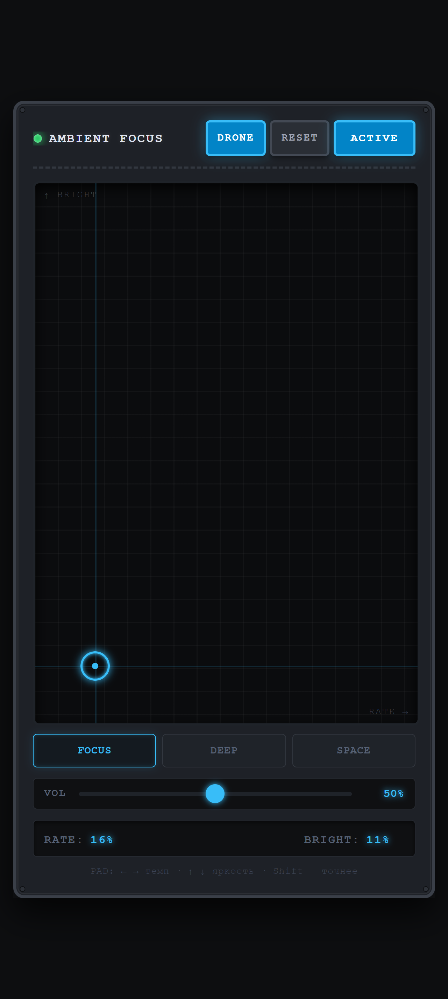

# 🌀 Ambient Focus Station

> Генеративный эмбиент-синтезатор в браузере для глубокой концентрации. Один HTML-файл, без сборки, без зависимостей — чистый Web Audio API и Web Components.

<p align="center">
  
</p>

<p align="center">
  <a href="https://pwrmind.github.io/ambient_focus_station/"><strong>▶ Открыть демо</strong></a>
</p>

---

## О проекте

**Ambient Focus Station** — это веб-компонент `<ambient-synth-rack>`, который генерирует бесконечную эмбиент-музыку прямо в браузере. Звук не воспроизводится из файлов — он синтезируется в реальном времени из осцилляторов, шума и эффектов.

Инструмент создан как рабочий фон для задач, требующих концентрации: написание кода, текста, аналитика, проектирование. В его основе — научные принципы влияния музыки на когнитивные функции: пентатонические лады без полутонов, мягкие тембры, отсутствие резкой ритмики.

### Возможности

- 🎛 **Интерактивный XY-пад** — управление темпом, яркостью и глубиной в реальном времени
- 🎵 **Три музыкальных лада** — FOCUS (C major pentatonic), DEEP (A# minor pentatonic), SPACE (C Lydian)
- 🌫 **Четыре звуковых слоя** — дрон, мелодические ноты, розовый шум, реверберация
- 🎚 **Управление громкостью** — общий уровень, независимый от XY-пада
- 💾 **Автосохранение настроек** — состояние восстанавливается при следующем запуске
- 📱 **Мобильная поддержка** — Pointer Events, `touch-action: none`, адаптивная вёрстка
- ♿ **Доступность** — управление падом с клавиатуры, ARIA-атрибуты, `:focus-visible`
- 🧩 **Atomic Design** — архитектура из атомов, молекул и организмов на базе Web Components
- 🎨 **9-slice рама** — интерфейс масштабируется без искажения углов и декоративных элементов
- 📦 **Zero dependencies** — весь код в одном HTML-файле, ~1200 строк

---

## Быстрый старт

### 1. Скачать и открыть

Скачайте `index.html` и откройте его в любом современном браузере. Всё.

### 2. Через GitHub Pages

```
Settings → Pages → Source: main / root
```

Через минуту интерфейс будет доступен по адресу `https://<username>.github.io/<repo>/`.

### 3. Локальный сервер (для разработки)

```bash
# Python 3
python -m http.server 8000

# Node.js
npx serve .

# PHP
php -S localhost:8000
```

Затем откройте `http://localhost:8000`.

> **Важно:** файл должен открываться либо с локального сервера, либо с `file://` — но в некоторых браузерах `localStorage` на `file://` может быть ограничен. Для стабильной работы рекомендуется http.

---

## Управление

| Элемент | Действие |
|---|---|
| **POWER** | Запуск / остановка аудио-движка (обязательный первый клик для активации AudioContext) |
| **DRONE** | Включение / отключение дрон-подложки (низкий гармонический гул) |
| **RESET** | Сброс всех параметров к значениям по умолчанию |
| **XY-PAD — перетаскивание** | Управление темпом (X) и яркостью (Y) |
| **XY-PAD — ← → ↑ ↓** | Точная настройка (с `Shift` — медленнее) |
| **XY-PAD — Home / End** | Переход в крайние позиции |
| **FOCUS / DEEP / SPACE** | Переключение музыкального лада |
| **VOL** | Общая громкость |

### Оси XY-пада

| Ось | Параметр | Что происходит |
|---|---|---|
| **X (→)** | RATE — плотность нот | Реже (фон) ⇄ чаще (активное движение) |
| **X (→)** | Уровень шума | Тише (шёпот) ⇄ громче (стена дождя) |
| **Y (↑)** | BRIGHT — яркость тона | Глухо (под водой) ⇄ открыто (воздушно) |
| **Y (↑)** | Reverb + Delay | Комната ⇄ бесконечный собор |

---

## Архитектура

Проект построен по методологии **Atomic Design** Брэда Фроста на базе нативных **Web Components**.

```
ambient-synth-rack  (Organism / Rack)
├── audio-led                (Atom)
├── audio-button             (Atom)
├── audio-xy-pad             (Organism)
├── audio-scale-selector     (Molecule)
│   └── button × 3           (native)
├── audio-volume-control     (Molecule)
│   └── input[type=range]    (native)
└── audio-display-param × 2  (Molecule)
```

### Уровни

- **Атомы** — неделимые визуальные элементы: LED-индикатор, кнопка, метка.
- **Молекулы** — композиции атомов: селектор лада, слайдер громкости, дисплей параметра.
- **Организмы** — самодостаточные модули: XY-пад, главный рэк.
- **Рэк** — корневой компонент, связывающий UI и аудио-движок.

### Взаимодействие

Компоненты общаются через `CustomEvent`, а не через прямые вызовы. Это даёт слабую связность и позволяет использовать любой элемент по отдельности.

```js
// XY-пад ничего не знает про аудио — он просто эмитит событие
this.dispatchEvent(new CustomEvent('pad-change', {
  detail: { x: 0.42, y: 0.78 },
  bubbles: true,
  composed: true  // пробивает Shadow DOM
}));

// Рэк слушает и решает, что делать
synthPad.addEventListener('pad-change', (e) => {
  this.state.x = e.detail.x;
  this.state.y = e.detail.y;
  this.applyAudioParams();
  this.saveSettings();
});
```

### 9-slice рама

Корпус устройства отрисован через `border-image` с SVG-паттерном: углы со «винтиками» остаются неизменными, рёбра и центр тянутся по размеру контейнера.

```css
.rack-unit {
  border: 15px solid transparent;
  border-image: url("data:image/svg+xml,...") 15 fill / 15px / 0 stretch;
}
```

Это классический приём из геймдизайна (Unity Sprite Editor, Android `.9.png`), реализованный на чистом CSS.

---

## Аудио-движок

Всё синтезируется в реальном времени через **Web Audio API**. Никаких семплов и mp3.

```
                     ┌────────────────┐
       НОТЫ ────────▶│  toneFilter    │
   (oscillators)     │  (lowpass)     │
                     └────┬───────┬───┘
                          │       │
                    ┌─────▼─┐  ┌──▼────────┐
                    │ DRY   │  │ Convolver │─▶ reverbWet ─┐
                    └───┬───┘  └───────────┘              │
                        │       ┌────────────────────┐    │
                        │       │ Delay + Filter +   │    │
                        │       │ Feedback Loop      │────┤
                        │       └────────────────────┘    │
                        │                                 │
      ДРОН ────▶ droneFilter ────▶ droneGain ────────────▶│
    (3× sine)                                            │
                                                         │
      ШУМ ────▶ HP ────▶ LP ────▶ Panner ────▶ noiseGain ▶│
   (pink noise)                                          │
                                                         ▼
                                                   ┌───────────┐
                                                   │ masterGain│
                                                   └─────┬─────┘
                                                         │
                                                   ┌─────▼─────┐
                                                   │ powerGain │───▶ 🔊
                                                   └───────────┘
```

### Слои

1. **Дрон** — три синусоидальных осциллятора (тоника + квинта + октава) с лёгким детюном, отфильтрованные до 450 Гц. Медленное тремоло от LFO (0.07 Гц). Меняется вместе с ладом.
2. **Мелодические ноты** — треугольные и синусоидальные осцилляторы, случайно выбранные из текущего лада. Атака 0.8–1.6 с, хвост 4.5–8 с. 25% — аккорды из двух нот с детюном ±6 центов.
3. **Розовый шум** — алгоритм Пола Келлетта, 4-секундный буфер. Фильтр 90–3000 Гц, стерео-панорама с LFO 0.045 Гц. Воспринимается как отдалённый дождь или водопад.
4. **Пространство** — параллельные шины:
   - **Convolver** с генерируемым импульсом 3.5 с — имитация большого помещения.
   - **Delay** с фильтрованным фидбеком (lowpass 1400 Гц, feedback 0.42).

### Управление плавностью

Все параметры меняются через `setTargetAtTime` и `linearRampToValueAtTime` — никаких резких переключений. Это критично для эмбиента: любое изменение должно быть «дыханием», а не «щелчком».

---

## Научная основа

Инструмент опирается на несколько принципов из когнитивной психологии и нейрофизиологии музыки:

### Почему пентатоника

**Ангемитонные лады** (без полутонов) не создают в мозге слухового напряжения, требующего разрешения. На ЭЭГ-исследованиях последовательности на пентатонике стабильно вызывают альфа-ритм и снижают нагрузку на рабочую память — тогда как хроматические интервалы заставляют мозг подсознательно прогнозировать исход диссонанса.

> *Pentatonic sequences and monaural beats to facilitate relaxation: an EEG study* — PMC/NIH

### Почему мягкие тембры

Синусоидальные и треугольные осцилляторы лишены резких гармоник, характерных для пилы или квадрата. Плюс — lowpass-фильтрация срезает всё выше 2–3 кГц. Это важно: высокие частоты (выше 4–5 кГц) активируют миндалевидное тело и могут повышать тревожность.

### Почему средний arousal

Согласно *Arousal-Mood Theory*, для продуктивной работы оптимален средний уровень возбуждения нервной системы. Слишком меланхоличная музыка уводит в пассивность, слишком радостная — активирует исполнительную сеть и отвлекает. Нейтральный мажор (FOCUS-лад) считается наиболее сбалансированным.

### Почему не бинауральные ритмы

«Чистые» бинауральные ритмы в наушниках часто вызывают дискомфорт. Однако встроенные в эмбиент-полотно, они могут усиливать тета- и альфа-активность. В текущей версии бинауральные ритмы не используются — это направление для будущих экспериментов.

> ⚠️ **Дисклеймер.** Научные исследования описывают статистические закономерности на группах, а не гарантии для каждого человека. Реакция на музыку сильно зависит от личности, опыта, familiarity и текущей задачи. Инструмент — это персонализируемый генератор фона, а не «научно доказанный рецепт».

---

## Кастомизация

### Использование как веб-компонента

```html
<script type="module" src="ambient-synth-rack.js"></script>

<ambient-synth-rack></ambient-synth-rack>
```

### Программное управление

```js
const rack = document.querySelector('ambient-synth-rack');

// Смена лада
rack.state.scaleMode = 'space';
rack.currentScale = rack.scales.space;

// Позиция XY-пада
rack.state.x = 0.8;
rack.state.y = 0.3;
rack.applyAudioParams();
```

### Добавление нового лада

Откройте файл и найдите объект `this.scales` в конструкторе `AmbientSynthRack`:

```js
this.scales = {
  focus: [130.81, 146.83, 164.81, 196.00, 220.00, ...],
  deep:  [116.54, 138.59, 155.56, 174.61, 207.65, ...],
  space: [130.81, 146.83, 164.81, 185.00, 196.00, ...],
  // Добавьте свой:
  japanese: [146.83, 155.56, 196.00, 220.00, 261.63, ...] // In-sen
};
```

Затем добавьте кнопку в `AudioScaleSelector`:

```html
<button class="mode-btn" data-scale="japanese" role="radio" aria-checked="false">IN</button>
```

### Смена дефолтных настроек

```js
this.defaults = Object.freeze({
  x: 0.5,
  y: 0.5,
  scaleMode: 'focus',
  volume: 0.5,
  drone: true
});
```

### Сброс сохранённого состояния

Если при разработке нужно очистить localStorage — откройте DevTools → Application → Local Storage → удалите ключ `ambient_synth_settings_v3`.

---

## Совместимость

| Браузер | Версия | Статус |
|---|---|---|
| Chrome / Edge | 66+ | ✅ Полная поддержка |
| Firefox | 76+ | ✅ Полная поддержка |
| Safari (macOS) | 14.1+ | ✅ Полная поддержка |
| Safari (iOS) | 14.5+ | ✅ Полная поддержка |
| Chrome Android | 66+ | ✅ Полная поддержка |
| Samsung Internet | 9+ | ✅ Полная поддержка |

**Требуется:**
- Web Audio API (везде с 2015 года)
- Web Components / Custom Elements v1 (Chrome 54+, Firefox 63+, Safari 10.1+)
- Pointer Events (для мобильной поддержки)
- ResizeObserver (для пересчёта позиции пада) — есть fallback на `window.resize`

---

## Roadmap

- [x] Базовый генератор на Web Audio API
- [x] XY-пад для управления параметрами
- [x] Три музыкальных лада
- [x] Поддержка мобильных устройств (Pointer Events)
- [x] Atomic Design через Web Components
- [x] Розовый шум и дрон-подложка
- [x] Автосохранение настроек
- [x] Адаптивная вёрстка с 9-slice
- [ ] Canvas-визуализатор (спектр / осциллограмма)
- [ ] Пресеты под задачу (Coding / Writing / Reading)
- [ ] Дополнительные атмосферные семплы (птицы, гром, прибой)
- [ ] Share-ссылки с seed-параметрами
- [ ] Светлая тема через второй SVG-фрейм
- [ ] Container queries вместо медиа-запросов
- [ ] Экспорт конфигурации в JSON
- [ ] Публикация как npm-пакета

---

## Идеи для форка

Если вы хотите развить проект, вот направления, которые кажутся интересными:

- **Добавить второй XY-пад** для «WARMTH» (сатурация) и «WIDTH» (стерео-ширина).
- **Интегрировать AudioWorklet** для генерации шума с меньшей нагрузкой на CPU.
- **Реализовать MIDI-вход** через Web MIDI API — управление с аппаратного контроллера.
- **Добавить визуализацию** через `AnalyserNode` и Canvas или WebGL.
- **Экспортировать в WAV** через `MediaRecorder` и `OfflineAudioContext`.
- **Переписать на TypeScript** с публикацией в npm.

---

## Лицензия

MIT — делайте что хотите, только сохраните копирайт.

---

## Благодарности

- [Web Audio API](https://developer.mozilla.org/en-US/docs/Web/API/Web_Audio_API) — без него ничего бы не было
- [Atomic Design](https://bradfrost.com/blog/post/atomic-web-design/) Брэда Фроста — методология, которая держит код в порядке
- [Tone.js](https://tonejs.github.io/) — вдохновение для многих API-решений, хотя в итоге обошлись без него
- Алгоритм генерации розового шума — [Пол Келлетт](https://www.firstpr.com.au/dsp/pink-noise/)
- Всем, кто присылает фидбек и баг-репорты

---

<p align="center">
  <sub>Сделано для тех, кому нужна тишина, но не полная.</sub>
</p>
